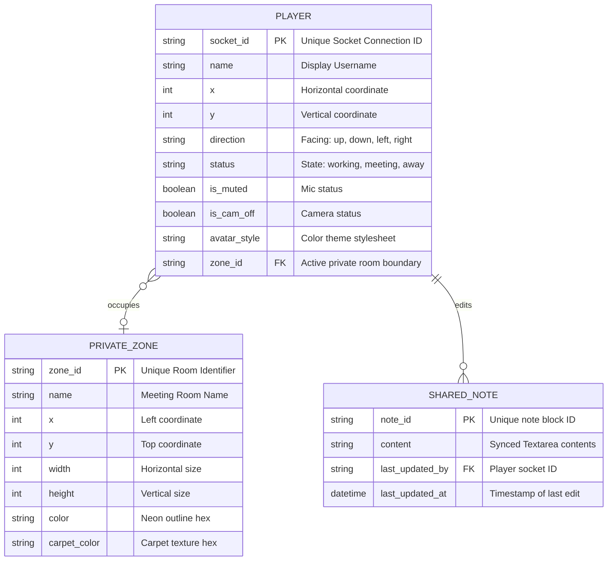

# Entity Relationship Diagram — Virtual Office MVP

## Entity Relationship Diagram

## Entity Descriptions

| Entity | Description | Key Attributes | Relationships |
| --- | --- | --- | --- |
| PLAYER | Represents an active user avatar in the virtual office. All properties are kept in memory and broadcasted dynamically. | `socket_id` (PK), `name`, `x`, `y`, `direction`, `status`, `zone_id` (FK) | Occupies 0 or 1 PRIVATE_ZONE. Edits the SHARED_NOTE. |
| PRIVATE_ZONE | Represents bounded meeting rooms in the workspace. Any player coordinates falling inside these boundaries are marked with the zone's ID. | `zone_id` (PK), `name`, `x`, `y`, `width`, `height` | Can contain many PLAYERs. |
| SHARED_NOTE | The collaborative text pad. Synthesizes input from multiple players. | `note_id` (PK), `content`, `last_updated_by` (FK) | Edited by PLAYERs. |

## Indexes and Constraints

- **Unique Socket ID:** `PLAYER.socket_id` must be unique per connection session.
- **Unique Zone ID:** `PRIVATE_ZONE.zone_id` must be unique.
- **Coord Constraints:** Player `x` and `y` must fall within the map dimensions ($0 \leq x \leq 1024$ and $0 \leq y \leq 800$).
- **Status Enum:** `PLAYER.status` must be one of: `working`, `meeting`, `away`.
- **Direction Enum:** `PLAYER.direction` must be one of: `up`, `down`, `left`, `right`.
