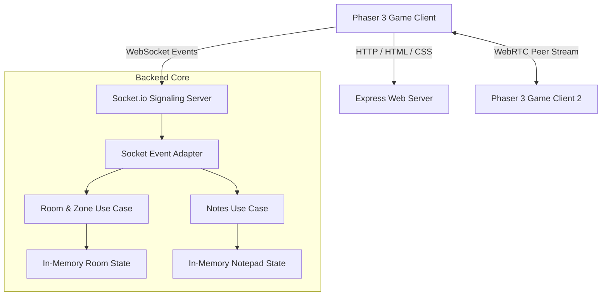
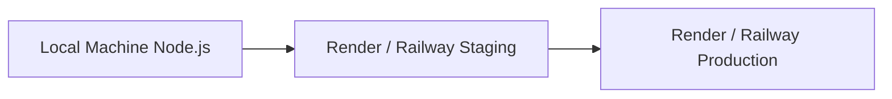

# System Architecture — Virtual Office MVP

## Overview

The Virtual Office MVP is designed using a Clean/Hexagonal Architecture style to decouple the core application domain logic (players, private zones, status changes, whiteboard/collaboration tools) from structural delivery mechanisms (Express HTTP server, Socket.io real-time event broker, WebRTC client peer interfaces). By establishing a strict unidirectional flow where adapters conform to interfaces defined in the application core, the backend server stays highly testable and robust, minimizing dependency lock-in.

## Component Architecture

### Component Descriptions

| Component | Responsibility | Technology |
| --- | --- | --- |
| Phaser 3 Game Client | Handles 2D rendering of the office map, avatar movement, player status HUD, and spatial distance checks. | Phaser 3 (HTML5/Canvas) |
| Express Web Server | Serves static frontend assets (HTML, CSS, JS) and coordinates environment configuration. | Node.js / Express |
| Socket.io Server | Handles player synchronization (coordinates, media toggle states, active zone) and acts as the WebRTC signaling broker (negotiation offer/answer/ICE). | socket.io |
| Room & Zone Use Case | Executes logical rules regarding player position mapping, room membership, and connection isolation. | Node.js |
| Notepad Use Case | Coordinates collaborative edits, maintaining notepad updates and broadcasting them to other players. | Node.js |
| In-Memory State Repositories | Stores current player positions, media configurations, active rooms, and note text in memory. | In-memory Javascript Objects |

## Data Flow

1. **Player Spawn & Joins:** Client sends display name and avatar style via WebSocket `join-office`. Server spawns the player in room state repository, broadcasts `new-player` to others, and sends `current-players` and `note-updated` back to client.
2. **Movement:** Client emits movement coordinate packet (`player-movement`). Server updates the coordinate store and broadcasts `player-moved` to other clients.
3. **Proximity Trigger:** Client checks coordinates of other players. If distance <= 150px or both in same private zone, triggers `webrtc-offer` broker event. Server forwards offer to target client to establish WebRTC connection.
4. **Notepad Sync:** Client types in note area, emitting `edit-note`. Server updates notes repository and broadcasts `note-updated` to others.

## Deployment Model

The MVP deploys a single monolithic application containing both the static frontend public files and the backend Node.js socket server.

## Security Architecture

- **Authentication:** For the MVP, players authenticate client-side by inputting a nickname. A unique session socket ID is generated on connection, which serves as their temporary identifier.
- **Authorization:** No specific RBAC (Role-Based Access Control) is implemented in MVP; all office users share the same collaborative workspace permissions.
- **Data Encryption:** WebSocket connections and WebRTC connections are secured in transit using TLS/WSS. Since the data is stored in-memory, encryption-at-rest is currently out of scope.

## Gate 1: Design Freeze

**Status:** DECLARED
**Date:** 2026-06-19T13:38:00Z
**Architecture baseline:** Node.js Express + Socket.io Server serving Phaser 3 client static assets. WebRTC signaling is routed through the Socket.io connection. No external databases are utilized for this stage.
**Change protocol:** Any architecture changes after this point require a new ADR.

## Flags from Previous Agents

No flags detected.
