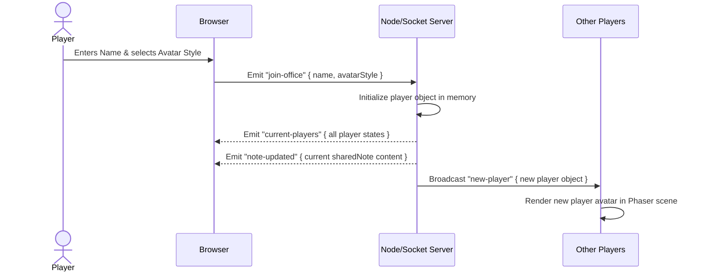
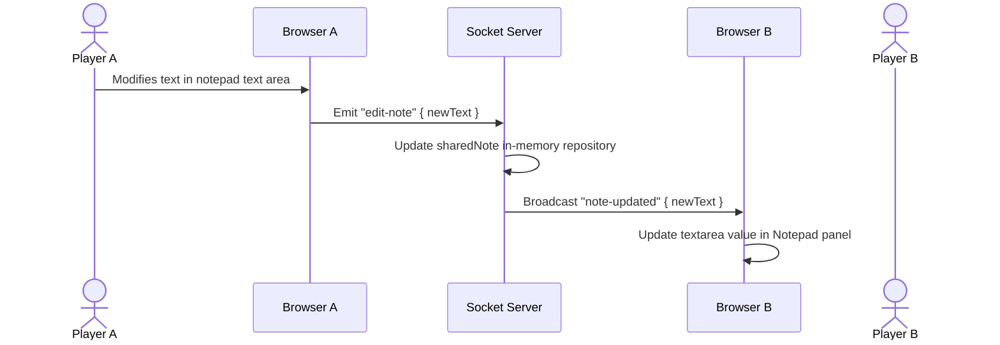

# Sequence Diagrams — Virtual Office MVP

## Sequence Diagrams

### Flow 1: Player Joining and Spawning



### Flow 2: Proximity Call Initiation (Public Space)

```mermaid
sequenceDiagram
    actor Player A
    participant Browser A
    participant Server as Socket Server (Signal Broker)
    participant Browser B
    actor Player B

    Player A->>Browser A: Walks close to Player B (distance <= 150px)
    Browser A->>Browser A: Detects proximity in game update loop
    Browser A->>Server: Emit "webrtc-offer" { targetId: B, sdp }
    Server->>Browser B: Forward "webrtc-offer" { senderId: A, sdp }
    Browser B->>Server: Emit "webrtc-answer" { targetId: A, sdp }
    Server->>Browser A: Forward "webrtc-answer" { senderId: B, sdp }
    Browser A<-->>Browser B: Exchange ICE Candidates via Server
    Browser A<-->Browser B: P2P Connection established directly
    Browser A & Browser B: Show live video feed in Sidebar HUD
```

### Flow 3: Private Zone Meeting Room Entry

```mermaid
sequenceDiagram
    actor Player A
    participant Browser A
    participant Server as Socket Server
    participant Browser B
    actor Player B

    Player A->>Browser A: Walks across neon boundary into Room 1
    Browser A->>Browser A: Identifies collision with Room 1 bounds
    Browser A->>Server: Emit "change-zone" "meeting_room_1"
    Server->>Browser B: Broadcast "player-zone-changed" { id: A, zoneId: Room 1 }
    Browser A & Browser B: Run Proximity Check
    Note over Browser A, Browser B: Since both are in Room 1 (same zoneId), connection is triggered even if dist > 150px
    Browser A->>Server: Emit "webrtc-offer" to Player B
    Server->>Browser B: Forward offer
    Browser B-->>Browser A: Answer and establish call
```

### Flow 4: Collaborative Notepad Sync


